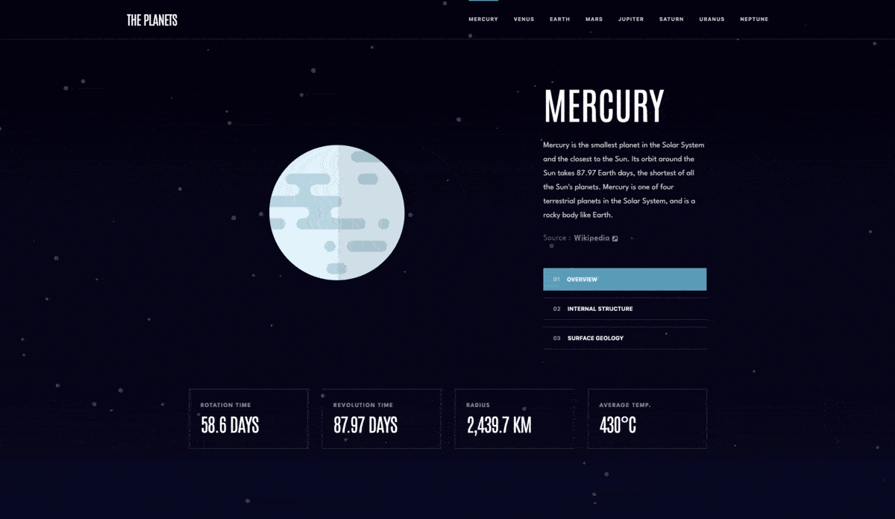

# Planets facts website

## Table of contents

- [Overview](#overview)
  - [The challenge](#the-challenge)
  - [Screenshot](#screenshot)
  - [Links](#links)
- [My process](#my-process)
  - [Built with](#built-with)
  - [What I learned](#what-i-learned)
- [Author](#author)

## Overview

### The challenge

Your users should be able to:

- View the optimal layout for the app depending on their device's screen size
- See hover states for all interactive elements on the page
- View each planet page and toggle between the "Overview", "Internal Structure", and "Surface Geology" tabs

### Screenshot

### Links

- [Solution URL](https://github.com/superpooperxxx/planets-facts)
- [Live Site URL](https://superpooperxxx.github.io/planets-facts/)

## My process

### Built with

- Semantic HTML5 markup
- CSS3: Grid, Flexbox
- BEM methodology: [BEM](https://en.bem.info/methodology/)
- Preprocessors: [Sass](https://sass-lang.com)
- Mobile-first workflow
- [React](https://reactjs.org/)
- [Particles.js](https://particles.js.org/)
- [GSAP](https://greensock.com/gsap/)

### What I learned

- All React components are functional and are using React hooks: useContext, useState, useEffect, useMemo, useCallback, useRef, etc.
- Learned how to optimize React app with useEffect and React.memo()
- For the first time used [Particles.js](https://particles.js.org/) and [GSAP](https://greensock.com/gsap/).
- Learned how to combine different libraries, so they don't have conflictes.

## Author

- Github - [superpooperxx](https://github.com/superpooperxxx)
- LinkedIn - [Kyrylo Haiduk](https://www.linkedin.com/in/kyrylo-haiduk/)
- Telegram - [@haidukwork](https://t.me/haidukwork)
- Frontend Mentor - [@superpooperxxx](https://www.frontendmentor.io/profile/superpooperxxx)
